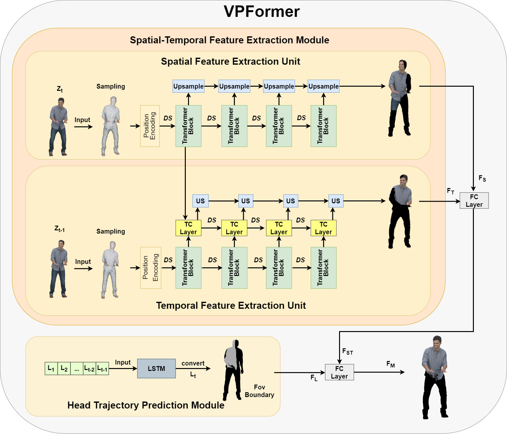

# VPFormer-main
This is the official implementation of VPFormer, a simple and efficient neural architecture for viewpoint prediction in 3D point cloud videos. For technical details, please refer to:

VPFormer: Leveraging Transformer with Voxel Integration for Viewport Prediction in Volumetric Video

Jie Li, Zhixia Zhao,  Qiyue Li, Zhixin Li, Pengyuan Zhou, Zhi Liu, Zhu Li

